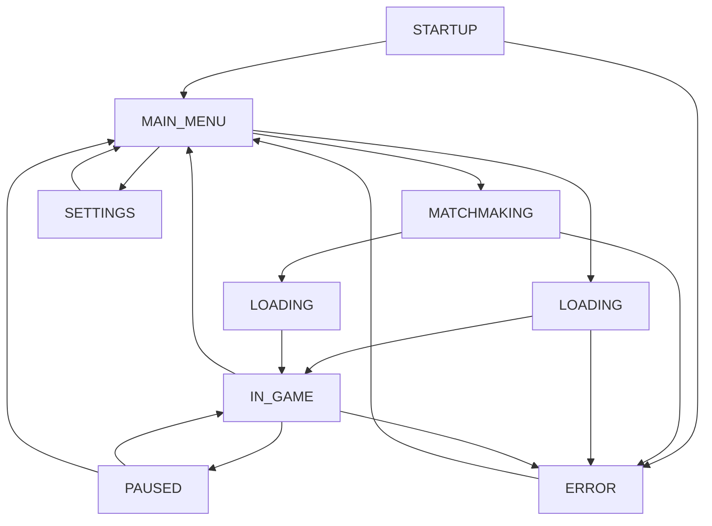

# 🎮 Cosmic UI Systems Integration Guide

## 📋 Overview

The Cosmic gaming project now features a comprehensive, professional-grade UI system with modern game features including main menus, matchmaking, loading screens, and state management. All systems are built with enterprise-level error handling and smooth user experiences.

## 🏗️ UI System Architecture

```
🎮 Game UI Architecture
├── 🎯 GameStateManager (Central Coordinator)
│   ├── State Management & Transitions
│   ├── UI System Coordination
│   ├── Event Handling
│   └── Error Recovery
│
├── 🎪 MainMenuSystem (Entry Point)
│   ├── Game Mode Selection
│   ├── Player Profile Display
│   ├── Settings Panel
│   ├── Achievements Panel
│   └── Visual Effects & Animations
│
├── 🔍 MatchmakingSystem (Multiplayer)
│   ├── Skill-Based Matching
│   ├── Game Mode Selection
│   ├── Lobby Management
│   ├── Real-Time Chat
│   └── Player Status Tracking
│
├── 📥 LoadingScreenSystem (Transitions)
│   ├── Progress Tracking
│   ├── Dynamic Tips
│   ├── Background Animations
│   ├── Task Management
│   └── Performance Monitoring
│
└── 🛡️ Error Handling Integration
    ├── Recovery Strategies
    ├── Graceful Degradation
    ├── State Validation
    └── Performance Monitoring
```

## 🎯 Game State Management

### State Flow Diagram



### Allowed State Transitions

| From State | To States | Trigger |
|------------|-----------|---------|
| STARTUP | MAIN_MENU, ERROR | System initialization |
| MAIN_MENU | MATCHMAKING, LOADING, SETTINGS | User action |
| MATCHMAKING | MAIN_MENU, LOADING, ERROR | User/System action |
| LOADING | IN_GAME, MAIN_MENU, ERROR | Loading completion/failure |
| IN_GAME | PAUSED, MAIN_MENU, LOADING | User action |
| PAUSED | IN_GAME, MAIN_MENU, SETTINGS | User action |
| SETTINGS | Previous state | User action |
| ERROR | MAIN_MENU, SHUTDOWN | Recovery/User action |

## 🎪 Main Menu System

### Features

- **🎨 Modern Visual Design**
  - Gradient backgrounds with particle effects
  - Animated UI elements with hover effects
  - Professional typography with custom fonts
  - Three.js-powered background animations

- **🎮 Game Mode Selection**
  - Single Player Campaign
  - Multiplayer Battles
  - Practice Mode
  - Custom Games

- **👤 Player Profile Integration**
  - Level and experience display
  - Achievement showcase
  - Win/loss statistics
  - Customizable avatars and titles

- **⚙️ Settings Management**
  - Graphics quality presets
  - Audio volume controls
  - Gameplay preferences
  - Accessibility options

### Code Example: Main Menu Usage

```typescript
import { MainMenuSystem } from './shared/ui/main-menu-system';

// Initialize main menu
const mainMenu = new MainMenuSystem();
await mainMenu.initialize();

// Listen for game start events
window.addEventListener('startSinglePlayer', () => {
    // Transition to loading screen
    gameStateManager.transitionTo(GameState.LOADING, { 
        loadingType: "singlePlayer" 
    });
});
```

## 🔍 Matchmaking System

### Features

- **🎯 Skill-Based Matching**
  - ELO rating system
  - Skill range expansion over time
  - Regional preferences
  - Ping-based optimization

- **🎮 Multiple Game Modes**
  - Quick Match (2-4 minutes)
  - Ranked Competitive (4-6 minutes)
  - Clan Wars (6-10 minutes)
  - Custom Lobbies (Instant)
  - Practice vs AI (Instant)

- **🏠 Lobby Management**
  - Real-time player status
  - Lobby chat system
  - Ready-up mechanics
  - Game settings display

- **📊 Real-Time Statistics**
  - Players online counter
  - Average wait times
  - Server status indicators
  - Regional server selection

### Code Example: Matchmaking Integration

```typescript
import { MatchmakingSystem, GameMode } from './shared/ui/matchmaking-system';

// Initialize matchmaking
const matchmaking = new MatchmakingSystem();
await matchmaking.initialize();

// Start matchmaking for ranked games
await matchmaking.startMatchmaking(GameMode.RANKED);

// Listen for match found events
window.addEventListener('startMultiplayerGame', (event) => {
    const { lobby, players } = event.detail;
    gameStateManager.transitionTo(GameState.LOADING, {
        loadingType: "multiplayer",
        lobby,
        players
    });
});
```

## 📥 Loading Screen System

### Features

- **📊 Progress Tracking**
  - Weighted task progress
  - Phase-based loading stages
  - Real-time progress updates
  - Estimated completion times

- **💡 Dynamic Tips System**
  - Rotating gameplay tips
  - Strategy guides
  - Control instructions
  - Lore and world-building

- **🎨 Visual Appeal**
  - Animated progress bars
  - Particle effects background
  - Smooth transitions
  - Customizable themes

- **⚡ Performance Optimization**
  - Efficient asset streaming
  - Background loading
  - Memory management
  - Error recovery

### Loading Phases

| Phase | Tasks | Weight | Description |
|-------|-------|--------|-------------|
| INITIALIZING | Engine startup | 10% | Core system initialization |
| ASSETS | Textures, audio, models | 40% | Asset loading and validation |
| WORLD_GENERATION | Procedural content | 30% | Galaxy and world generation |
| NETWORK_CONNECTION | Server connection | 10% | Multiplayer connectivity |
| PLAYER_DATA | Profile and settings | 5% | User data synchronization |
| GAME_SYSTEMS | AI, physics, etc. | 5% | Game system initialization |

### Code Example: Loading Screen Usage

```typescript
import { LoadingScreenSystem } from './shared/ui/loading-screen-system';

// Create custom loading tasks
const loadingTasks = [
    {
        id: "load_galaxy",
        name: "Generating Galaxy",
        phase: "WORLD_GENERATION",
        weight: 0.4,
        status: "pending",
        progress: 0,
        estimatedTime: 5000
    }
];

// Show loading screen
const loadingScreen = new LoadingScreenSystem();
await loadingScreen.show(loadingTasks);

// Update progress during loading
await loadingScreen.updateTaskProgress("load_galaxy", 0.5, "loading");
await loadingScreen.updateTaskProgress("load_galaxy", 1.0, "complete");
```

## 🎮 Integration Example: Complete Game Flow

```typescript
import { GameStateManager } from './shared/ui/game-state-manager';
import { MainMenuSystem } from './shared/ui/main-menu-system';
import { MatchmakingSystem } from './shared/ui/matchmaking-system';
import { LoadingScreenSystem } from './shared/ui/loading-screen-system';

class CosmicGame {
    private stateManager: GameStateManager;

    async initialize() {
        // Initialize state manager with all UI systems
        this.stateManager = new GameStateManager({
            persistState: true,
            enableStateHistory: true,
            maxHistorySize: 100
        });

        await this.stateManager.initialize();

        // Setup global event listeners
        this.setupEventListeners();

        console.log("🎮 Cosmic Game initialized successfully!");
    }

    private setupEventListeners() {
        // Game state changes
        this.stateManager.addEventListener('stateChange', (newState, oldState) => {
            console.log(`🎯 State changed: ${oldState} → ${newState}`);
            this.handleStateChange(newState, oldState);
        });

        // Single player game start
        window.addEventListener('startSinglePlayer', () => {
            this.startSinglePlayerGame();
        });

        // Multiplayer game start
        window.addEventListener('startMultiplayerGame', (event) => {
            this.startMultiplayerGame(event.detail);
        });

        // Loading completion
        window.addEventListener('loadingComplete', (event) => {
            this.onLoadingComplete(event.detail);
        });

        // Error handling
        window.addEventListener('gameError', (event) => {
            this.handleGameError(event.detail);
        });
    }

    private async startSinglePlayerGame() {
        await this.stateManager.transitionTo('LOADING', {
            loadingType: 'singlePlayer',
            gameMode: 'campaign'
        });
    }

    private async startMultiplayerGame(gameData: any) {
        await this.stateManager.transitionTo('LOADING', {
            loadingType: 'multiplayer',
            lobby: gameData.lobby,
            players: gameData.players
        });
    }

    private onLoadingComplete(loadingData: any) {
        console.log(`🎮 Loading completed in ${loadingData.totalTime}ms`);
        
        // Start the actual game
        this.initializeGameWorld();
    }

    private handleStateChange(newState: string, oldState: string) {
        // Handle UI updates based on state changes
        switch (newState) {
            case 'IN_GAME':
                this.hideAllMenus();
                this.showGameUI();
                break;
                
            case 'PAUSED':
                this.showPauseMenu();
                break;
                
            case 'MAIN_MENU':
                this.hideGameUI();
                this.showMainMenu();
                break;
        }
    }

    private async initializeGameWorld() {
        // Initialize game systems
        await this.initializeGameSystems();
        
        // Transition to game state
        await this.stateManager.transitionTo('IN_GAME');
    }

    private handleGameError(error: any) {
        console.error("🚨 Game error:", error);
        this.stateManager.transitionTo('ERROR', { error });
    }

    // Utility methods
    private hideAllMenus() { /* Hide all menu systems */ }
    private showGameUI() { /* Show in-game UI */ }
    private showPauseMenu() { /* Show pause menu */ }
    private showMainMenu() { /* Show main menu */ }
    private hideGameUI() { /* Hide game UI */ }
    private async initializeGameSystems() { /* Initialize game systems */ }
}

// Start the game
const game = new CosmicGame();
game.initialize();
```

## 🛡️ Error Handling Integration

### Recovery Strategies

Each UI system implements the `ErrorRecoverable` interface:

```typescript
interface ErrorRecoverable {
    executeFallback(): Promise<boolean>;
    getSystemState(): any;
    validateState(): boolean;
    resetToSafeState(): Promise<void>;
    getHealthStatus(): SystemHealth;
}
```

### Error Recovery Examples

```typescript
// Main Menu Error Recovery
mainMenuSystem.recoveryChain
    .addStrategy("reloadMenuAssets", async () => {
        return await this.reloadMenuAssets();
    }, 3)
    .addStrategy("resetToMainMenu", async () => {
        return await this.resetToMainMenu();
    }, 2)
    .addStrategy("useBasicMenu", async () => {
        return await this.useBasicMenu();
    }, 1);

// Matchmaking Error Recovery  
matchmakingSystem.recoveryChain
    .addStrategy("retrySearch", async () => {
        return await this.retrySearch();
    }, 3)
    .addStrategy("relaxCriteria", async () => {
        return await this.relaxSearchCriteria();
    }, 2)
    .addStrategy("createSoloLobby", async () => {
        return await this.createSoloLobby();
    }, 1);

// Loading Screen Error Recovery
loadingScreenSystem.recoveryChain
    .addStrategy("retryFailedTasks", async () => {
        return await this.retryFailedTasks();
    }, 3)
    .addStrategy("skipNonCriticalTasks", async () => {
        return await this.skipNonCriticalTasks();
    }, 2)
    .addStrategy("emergencyComplete", async () => {
        return await this.emergencyComplete();
    }, 1);
```

## 🎨 Visual Design Guidelines

### Color Scheme

```css
:root {
    --primary-color: #0096FF;      /* Cosmic Blue */
    --secondary-color: #6420FF;    /* Deep Purple */
    --accent-color: #00FFFF;       /* Cyan */
    --background: #000011;         /* Deep Space */
    --text-color: #FFFFFF;         /* White */
    --success-color: #00FF80;      /* Green */
    --warning-color: #FFAA00;      /* Orange */
    --error-color: #FF4444;        /* Red */
}
```

### Typography

```css
@import url('https://fonts.googleapis.com/css2?family=Orbitron:wght@400;700;900&display=swap');
@import url('https://fonts.googleapis.com/css2?family=Exo+2:wght@300;400;600&display=swap');

.cosmic-title {
    font-family: 'Orbitron', monospace;
    font-weight: 900;
    background: linear-gradient(45deg, var(--primary-color), var(--accent-color));
    -webkit-background-clip: text;
    -webkit-text-fill-color: transparent;
}

.cosmic-text {
    font-family: 'Exo 2', sans-serif;
    font-weight: 400;
}
```

### Animation Examples

```css
@keyframes cosmicGlow {
    0%, 100% { 
        box-shadow: 0 0 20px var(--primary-color); 
    }
    50% { 
        box-shadow: 0 0 40px var(--accent-color); 
    }
}

@keyframes starPulse {
    0%, 100% { 
        opacity: 0.6; 
        transform: scale(1); 
    }
    50% { 
        opacity: 1; 
        transform: scale(1.1); 
    }
}

.cosmic-button {
    background: linear-gradient(135deg, rgba(0, 150, 255, 0.1), rgba(100, 0, 255, 0.1));
    border: 2px solid var(--primary-color);
    transition: all 0.3s cubic-bezier(0.4, 0, 0.2, 1);
}

.cosmic-button:hover {
    transform: scale(1.05);
    box-shadow: 0 0 20px var(--primary-color);
    animation: cosmicGlow 2s ease-in-out infinite;
}
```

## 📊 Performance Optimization

### Resource Management

- **Asset Preloading**: Critical assets loaded during initialization
- **Memory Pooling**: Reuse UI elements to prevent garbage collection
- **Lazy Loading**: Non-critical assets loaded on-demand
- **Texture Optimization**: Multiple quality levels for different devices

### Rendering Optimization

- **RequestAnimationFrame**: Smooth 60 FPS animations
- **Canvas Optimization**: Efficient particle system rendering
- **CSS Hardware Acceleration**: GPU-accelerated transforms
- **Virtual Scrolling**: Efficient rendering of large lists

### Network Optimization

- **Connection Pooling**: Reuse WebSocket connections
- **Message Compression**: Reduce bandwidth usage
- **Offline Support**: Graceful degradation without network
- **Caching**: Smart caching of frequently accessed data

## 🧪 Testing Strategies

### Unit Testing

```typescript
describe('GameStateManager', () => {
    let stateManager: GameStateManager;
    
    beforeEach(() => {
        stateManager = new GameStateManager();
    });
    
    it('should transition to main menu on startup', async () => {
        await stateManager.initialize();
        expect(stateManager.getCurrentState()).toBe(GameState.MAIN_MENU);
    });
    
    it('should handle invalid transitions gracefully', async () => {
        await stateManager.initialize();
        const result = await stateManager.transitionTo(GameState.IN_GAME);
        expect(result).toBe(false);
    });
});
```

### Integration Testing

```typescript
describe('UI System Integration', () => {
    it('should complete full game flow', async () => {
        const game = new CosmicGame();
        await game.initialize();
        
        // Simulate user starting single player
        window.dispatchEvent(new CustomEvent('startSinglePlayer'));
        
        // Wait for loading to complete
        await waitForEvent('loadingComplete');
        
        // Verify game started
        expect(game.getCurrentState()).toBe(GameState.IN_GAME);
    });
});
```

## 🚀 Deployment Considerations

### Build Configuration

```json
{
  "scripts": {
    "build": "webpack --mode=production",
    "build:dev": "webpack --mode=development",
    "serve": "webpack serve --mode=development"
  },
  "webpack": {
    "optimization": {
      "splitChunks": {
        "chunks": "all",
        "cacheGroups": {
          "ui": {
            "test": /[\\/]ui[\\/]/,
            "name": "ui-systems",
            "priority": 10
          }
        }
      }
    }
  }
}
```

### Asset Optimization

- **Image Compression**: WebP format with fallbacks
- **Audio Compression**: OGG/MP3 with quality presets
- **Code Minification**: UglifyJS with dead code elimination
- **Bundle Splitting**: Separate chunks for different UI systems

## 📈 Future Enhancements

### Planned Features

1. **🎨 Advanced Visual Effects**
   - Shader-based particle systems
   - Dynamic lighting effects
   - Post-processing pipelines

2. **🔊 Enhanced Audio**
   - Spatial audio positioning
   - Dynamic music composition
   - Voice chat integration

3. **🌐 Social Features**
   - Friend lists and messaging
   - Clan management interfaces
   - Leaderboards and rankings

4. **📱 Platform Support**
   - Mobile responsive design
   - Touch gesture controls
   - Cross-platform synchronization

5. **🤖 AI Integration**
   - Smart matchmaking algorithms
   - Intelligent tip suggestions
   - Predictive loading

## 📚 API Reference

### GameStateManager

```typescript
class GameStateManager {
    // State management
    getCurrentState(): GameState
    transitionTo(newState: GameState, metadata?: any): Promise<boolean>
    getStateHistory(): StateTransition[]
    
    // Event handling
    addEventListener(event: string, listener: Function): void
    removeEventListener(event: string, listener: Function): void
    
    // UI system access
    getUISystem<T>(name: keyof UISystemRegistry): T | undefined
    
    // Health and recovery
    getHealthStatus(): SystemHealth
    executeFallback(): Promise<boolean>
}
```

### MainMenuSystem

```typescript
class MainMenuSystem {
    // Initialization
    initialize(): Promise<void>
    
    // State management
    transitionToState(newState: MenuState): Promise<void>
    
    // Player profile
    loadPlayerProfile(): Promise<void>
    
    // Health and recovery
    getHealthStatus(): SystemHealth
    dispose(): void
}
```

### MatchmakingSystem

```typescript
class MatchmakingSystem {
    // Matchmaking
    startMatchmaking(gameMode: GameMode): Promise<void>
    cancelSearch(): void
    
    // Lobby management
    joinLobby(lobbyId: string): Promise<boolean>
    leaveLobby(): void
    
    // UI management
    show(): void
    hide(): void
    
    // Health and recovery
    getHealthStatus(): SystemHealth
    dispose(): void
}
```

### LoadingScreenSystem

```typescript
class LoadingScreenSystem {
    // Loading management
    show(loadingTasks?: LoadingTask[]): Promise<void>
    hide(): Promise<void>
    updateTaskProgress(taskId: string, progress: number, status?: string): Promise<void>
    
    // Progress tracking
    getLoadingProgress(): number
    getCurrentPhase(): LoadingPhase
    getTotalLoadingTime(): number
    
    // Health and recovery
    getHealthStatus(): SystemHealth
    dispose(): void
}
```

## 📞 Support and Documentation

For additional help and documentation:

- **Error Handling Guide**: `docs/error-handling-integration-complete.md`
- **API Documentation**: Generated TypeDoc documentation
- **Performance Guide**: Performance optimization best practices
- **Deployment Guide**: Production deployment instructions

---

## 🎯 Summary

The Cosmic UI system provides a comprehensive, professional-grade user interface with:

✅ **Complete Game Flow** - From startup to gameplay with smooth transitions  
✅ **Modern Visual Design** - Professional UI with animations and effects  
✅ **Robust Error Handling** - Enterprise-level reliability and recovery  
✅ **Performance Optimized** - 60 FPS animations and efficient resource usage  
✅ **Scalable Architecture** - Easy to extend and maintain  
✅ **Cross-Platform Ready** - Responsive design for multiple devices  

The system ensures players have a smooth, engaging experience from the moment they start the game until they're playing in the cosmic universe! 